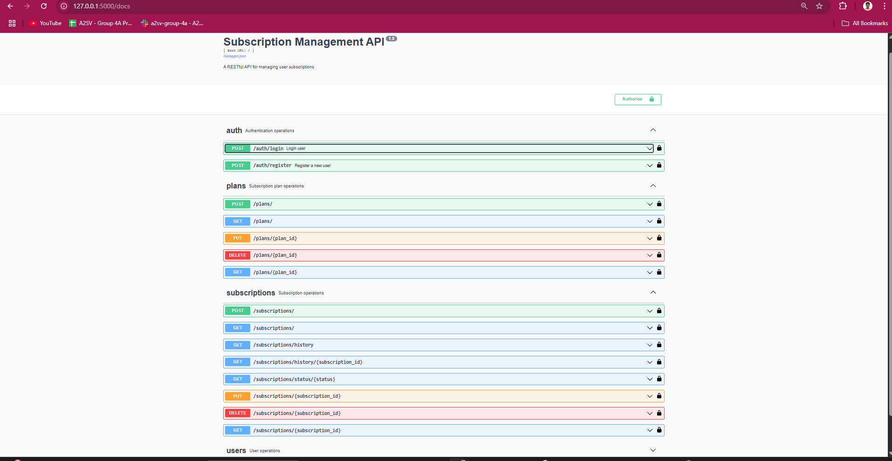

# Subscription Management API

A RESTful API for managing user subscriptions with optimized database queries and performance considerations.

## API Overview



The API provides comprehensive endpoints for managing subscriptions, including user authentication, plan management, and subscription operations.

## Features

- User registration and authentication
- Subscription plan management
- User subscription handling (subscribe, upgrade, cancel)
- Optimized database queries with proper indexing
- Performance monitoring and analysis

## Setup Instructions

### Using Docker

1. Build the Docker image:
```bash
docker build -t subscription-api .
```

2. Run the container:
```bash
docker run -p 5000:5000 subscription-api
```

3. Access the API:
   - The API will be available at `http://localhost:5000`
   - Use the Swagger documentation at `http://localhost:5000/api/docs`

### Local Development

1. Create a virtual environment:
```bash
python -m venv venv
source venv/bin/activate  # On Windows: venv\Scripts\activate
```

2. Install dependencies:
```bash
pip install -r requirements.txt
```

3. Initialize and set up the database:
```bash
# Initialize the database migrations
flask --app "app:create_app('development')" db init

# Create the initial migration
flask --app "app:create_app('development')" db migrate -m "Initial migration"

# Apply the migrations to create/update the database schema
flask --app "app:create_app('development')" db upgrade
```

4. Run the application:
```bash
python run.py
```

## API Documentation

### Authentication Endpoints
- POST /auth/register - Register a new user
- POST /auth/login - Login user

### Subscription Plan Endpoints
- GET /plans - List all subscription plans
- POST /plans - Create a new subscription plan (admin only)

### Subscription Endpoints
- POST /subscriptions - Subscribe to a plan
- PUT /subscriptions/<subscription_id> - Update subscription
- DELETE /subscriptions/<subscription_id> - Cancel subscription
- GET /subscriptions - List user's subscriptions


## Database Optimization

The API includes several optimizations:
- Proper indexing on frequently queried columns
- Optimized raw SQL queries where needed
- Efficient subscription status tracking
- Caching strategies for frequently accessed data

### Subscription History Optimization Decisions

The subscription history endpoints have been specifically optimized for performance and scalability:

#### 1. Query Optimization
- Implemented single-query approach using JOINs instead of multiple separate queries
- Used `contains_eager` for subscription relationships to prevent N+1 query problems
- Leveraged SQLAlchemy's `joinedload` for efficient eager loading of related data
- Optimized query planning through strategic JOIN ordering

#### 2. Database Indexing Strategy
- Created composite indexes for common query patterns:
  ```sql
  -- For single subscription history queries
  CREATE INDEX idx_subscription_history_sub_date 
  ON subscription_history (subscription_id, changed_at);
  
  -- For user's subscription history queries
  CREATE INDEX idx_subscription_history_user_sub_date 
  ON subscription_history (user_id, subscription_id, changed_at);
  
  -- For filtering by change type
  CREATE INDEX idx_subscription_history_change_type 
  ON subscription_history (change_type);
  ```

#### 3. Relationship Loading Optimization
- Set default eager loading with `lazy='joined'` for frequently accessed relationships
- Configured backref relationships for bidirectional access
- Optimized lazy loading strategies based on access patterns:
  ```python
  subscription = db.relationship('Subscription', backref='history', lazy='joined')
  user = db.relationship('User', lazy='joined')
  old_plan = db.relationship('SubscriptionPlan', lazy='joined')
  new_plan = db.relationship('SubscriptionPlan', lazy='joined')
  ```

## Testing

Run tests using pytest:(not implemented)
```bash
pytest
``` 